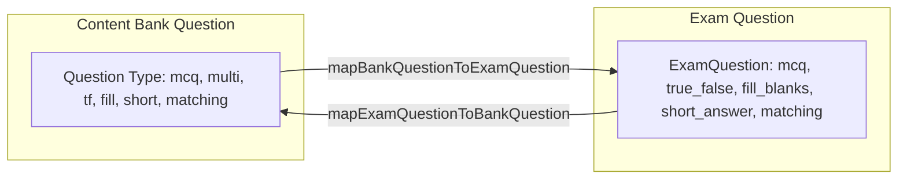

# Content Bank (بنك المحتوى) — Architecture & Integration Documentation

> **Status:** Hardened Implementation (Mock & Hybrid Architecture)  
> **Backend Integration Status:** UNVERIFIED — All API endpoints and contracts documented below require backend confirmation prior to switching production flags.

---

## 1. Feature Overview & Routes

The **Content Bank (بنك المحتوى)** serves as a centralized, institutional resource repository within the platform. It enables educators and administrators to organize, author, search, reuse, and bulk-manage academic content across courses and exams without repetitive re-authoring.

### Routes

| Route | View Mode / Purpose | Description |
| :--- | :--- | :--- |
| `/academic/bank` | **Mode A:** Library Grid<br>**Mode B:** Flat Results List | Main landing page displaying all libraries with item counts, search, and kind filter chips. When search or kind filters are active, switches seamlessly to a flat paginated results view. |
| `/academic/bank/[libraryId]` | **Library Details View** | In-library view displaying all content items within a specific library, supporting kind tabs (`الكل`, `الدروس`, `الفيديوهات`, `الأسئلة`), in-library search, pagination, floating bulk actions toolbar (`نقل`, `نسخ`, `حذف`), and item detail/edit modals. |

---

## 2. File Map

| File Path | Architecture Role & Summary |
| :--- | :--- |
| `src/types/bank.ts` | Core TypeScript interfaces and discriminated unions for Library, BankItem (Lesson, Video, Question), Question types, API payloads, and paginated responses. |
| `src/constants/bank.ts` | Metadata registries for kinds, 8 question types, difficulty levels, curated library color palette, and Arabic count pluralization helpers. |
| `src/services/bank.ts` | Unified service adapter with in-memory mock store, seed data, and REST API client calls toggled by `USE_MOCK_BANK`. |
| `src/services/bank-exam-mapper.ts` | Bidirectional data mappers (`mapBankQuestionToExamQuestion`, `mapExamQuestionToBankQuestion`) with exam compatibility checks and validation rules. |
| `src/hooks/useBank.ts` | TanStack React Query hooks with unified query key factory (`bankKeys`) and comprehensive cache invalidation. |
| `src/hooks/useBankStore.ts` | Zustand global store for landing page filters, search queries, and multi-selection state. |
| `src/components/Academic/Bank/AddBankItemModal.tsx` | Creation modal for adding lessons, uploading/linking videos, or selecting a question type to author. |
| `src/components/Academic/Bank/BankEmptyState.tsx` | Empty state illustrations and actions for empty libraries and zero search results. |
| `src/components/Academic/Bank/BankErrorState.tsx` | Standardized error banner with retry trigger for failed data queries. |
| `src/components/Academic/Bank/BankFilters.tsx` | Landing page search input and kind filter chips with live item counts. |
| `src/components/Academic/Bank/BankHeader.tsx` | Landing page header with title, resource center badge, mock mode indicator, and create library CTA. |
| `src/components/Academic/Bank/BankItemDetailModal.tsx` | Comprehensive view/edit/author modal for lessons, videos, and 8 question types with LaTeX support. |
| `src/components/Academic/Bank/BankItemRow.tsx` | Item row component with selection checkbox, kind badges, metadata line, usage pill, and preview button. |
| `src/components/Academic/Bank/BankPagination.tsx` | Page navigation bar displaying current item range and previous/next page buttons. |
| `src/components/Academic/Bank/BankSkeleton.tsx` | Pulsing loading skeletons for library grid and item list views. |
| `src/components/Academic/Bank/BulkActionToolbar.tsx` | Floating bottom toolbar for batch move, duplicate, and delete operations on selected items. |
| `src/components/Academic/Bank/CreateLibraryModal.tsx` | Modal for creating new content libraries with name, description, color swatches, and quick-fill chips. |
| `src/components/Academic/Bank/DeleteConfirmModal.tsx` | Deletion dialog showing selected item count, double-submit protection, and usage warning if items are referenced. |
| `src/components/Academic/Bank/LibraryCard.tsx` | Visual card component for libraries showing color accent, total count, kind breakdown, and relative update date. |
| `src/components/Academic/Bank/LibraryHeader.tsx` | Library detail header supporting normal navigation mode and multi-selection header mode with select-all/clear. |
| `src/components/Academic/Bank/LibrarySearch.tsx` | Debounced in-library search input with clear button. |
| `src/components/Academic/Bank/LibraryTabs.tsx` | Kind filter tabs (`الكل`, `الدروس`, `الفيديوهات`, `الأسئلة`) with dynamic count badges. |
| `src/components/Academic/Bank/MoveLibraryModal.tsx` | Modal to select a target library and move selected items in batch. |
| `src/components/Academic/Exam/BankPickerModal.tsx` | Exam builder modal for picking and importing supported questions from Content Bank. |
| `src/components/Academic/Exam/QuestionEditorModal.tsx` | Exam question editor featuring the optional "Save a copy to Content Bank" workflow. |
| `src/components/Academic/Exam/ExamOverviewTab.tsx` | Exam overview tab integrating the "من بنك الأسئلة" bulk picker trigger. |
| `src/components/Academic/Exam/ExamModal.tsx` | Main exam builder container orchestrating question flow and bank picker integrations. |
| `src/components/Academic/Exam/AddQuestionModal.tsx` | Exam question type picker offering a direct entry point to the Content Bank. |
| `src/components/Academic/Exam/ExamQuestionsSidebar.tsx` | Exam question sidebar footer providing shortcut access to Content Bank. |
| `src/app/academic/bank/page.tsx` | Landing page route managing Mode A (Grid) and Mode B (Search/Filter List). |
| `src/app/academic/bank/[libraryId]/page.tsx` | Library details page route managing filters, pagination, selection, and modals. |

---

## 3. Data Model

### Library Structure
```typescript
interface Library {
  id: string | number;
  name: string;
  description?: string;
  color?: string; // Hex color code (e.g. #6366F1)
  createdAt?: string; // ISO 8601 string
  updatedAt?: string; // ISO 8601 string
  itemCounts?: {
    lesson: number;
    video: number;
    question: number;
    total: number;
  };
}
```

### BankItem Discriminated Union
```typescript
type BankItem = LessonBankItem | VideoBankItem | QuestionBankItem;

interface BaseBankItem {
  id: string | number;
  libraryId: string | number;
  unit?: string;
  tags?: string[];
  usageCount: number; // Number of times item is used in courses/exams
  createdAt: string;
  updatedAt: string;
}

interface LessonBankItem extends BaseBankItem {
  kind: 'lesson';
  title: string;
  content?: string;
  pdfUrl?: string;
}

interface VideoBankItem extends BaseBankItem {
  kind: 'video';
  title: string;
  source: 'upload' | 'library' | 'url';
  url: string;
  duration?: number; // In seconds
}

interface QuestionBankItem extends BaseBankItem {
  kind: 'question';
  question: Question;
}
```

### Question Types & Correct-Answer Conventions

```typescript
type QuestionType =
  | 'mcq'      // Single-choice multiple choice
  | 'multi'    // Multi-select multiple choice
  | 'tf'       // True / False
  | 'short'    // Short text answer
  | 'fill'     // Fill in the blanks
  | 'numeric'  // Numeric value with tolerance
  | 'matching' // Matching prompt/target pairs
  | 'essay';   // Long essay requiring manual evaluation
```

| Question Type | `question.correct` Schema | Field Details |
| :--- | :--- | :--- |
| `mcq` | `string` | Option ID matching one item in `options: QuestionOption[]`. |
| `multi` | `string[]` | Array of Option IDs matching correct items in `options: QuestionOption[]`. |
| `tf` | `boolean` | `true` for True (صح), `false` for False (خطأ). |
| `short` | `string` | Model answer string (also mirrored in `question.sampleAnswer`). |
| `fill` | `string[]` | Ordered array of strings corresponding to `{dash}` markers in `blanksTemplate`. |
| `numeric` | `undefined` (`value`, `tol`, `unit`) | `question.value: number`, `question.tol: number` (tolerance), `question.unit?: string`. |
| `matching` | `undefined` (`pairs`) | `pairs: { id: string; left: string; right: string }[]` (each pair represents a valid match). |
| `essay` | `undefined` (`sampleAnswer`, `rubric`) | `sampleAnswer?: string`, `rubric?: string` (grading criteria for manual review). |

---

## 4. Forward and Reverse Mapper Rules

The bidirectional mapper is located in `src/services/bank-exam-mapper.ts`.



### Forward Mapper (`mapBankQuestionToExamQuestion`)
Translates a Content Bank question into an `ExamQuestion` for use in the exam builder and player.

- **`mcq`** $\rightarrow$ `mcq` (single choice, `conditions.multipleCorrectAnswer: false`, randomized order translated from `!keepOrder`).
- **`multi`** $\rightarrow$ `mcq` (multi choice, `conditions.multipleCorrectAnswer: true`).
- **`tf`** $\rightarrow$ `true_false` (stores boolean in `trueFalseValue`).
- **`fill`** $\rightarrow$ `fill_blanks` (translates blanks template and aligns answers; validates matching counts).
- **`short`** $\rightarrow$ `short_answer` (transfers `sampleAnswer`).
- **`matching`** $\rightarrow$ `matching` (maps `left` $\rightarrow$ `prompt`, `right` $\rightarrow$ `target`).
- **Provenance:** Injects `bankRef: q.id` into the generated `ExamQuestion`.
- **Unsupported Types:** `numeric` and `essay` are rejected (`ok: false`) with reason `"غير مدعوم في الاختبارات حالياً"`.

### Reverse Mapper (`mapExamQuestionToBankQuestion`)
Translates an `ExamQuestion` drafted in the exam builder into a Content Bank question payload for "Save a copy to bank".

- **Validation Rules:**
  - `title` must not be empty.
  - Image questions (`questionImage`, option `image_url`, pair `image_url`) are rejected because bank image upload is unverified.
  - `image_answer` question type is rejected.
  - `mcq` (single) requires $\ge 2$ options and exactly 1 correct answer.
  - `mcq` (multi) requires $\ge 2$ options and $\ge 1$ correct answer.
  - `true_false` requires a selected boolean answer.
  - `fill_blanks` requires `{dash}` or `___` tokens matching answer count.
  - `matching` requires $\ge 2$ completed prompt-target pairs.
- **Excluded Fields:** Exam `description` is not persisted to bank item (bank questions use `text` and `explanation`).

---

## 5. Assumed API Endpoints

> [!IMPORTANT]
> **UNVERIFIED — All endpoints below need backend confirmation.**  
> Base path is assumed relative to the `academyApi` Axios instance (default `/academy/` or root api).

| Method | Assumed Path | Payload Shape | Response Shape (`ApiResponse<T>`) | Verification Status |
| :--- | :--- | :--- | :--- | :--- |
| `GET` | `content-bank/libraries` | _None_ | `{ data: Library[] }` | **UNVERIFIED — needs backend confirmation** |
| `POST` | `content-bank/libraries` | `{ name: string, description?: string, color?: string }` | `{ data: Library }` | **UNVERIFIED — needs backend confirmation** |
| `PUT` | `content-bank/libraries/:id` | `{ name?: string, description?: string, color?: string }` | `{ data: Library }` | **UNVERIFIED — needs backend confirmation** |
| `DELETE`| `content-bank/libraries/:id` | _None_ | `{ data: { success: boolean } }` | **UNVERIFIED — needs backend confirmation** |
| `GET` | `content-bank/items` | `params: { libraryId?, kind?, difficulty?, tag?, q?, page?, limit? }` | `{ data: PaginatedBankItemsResponse }` | **UNVERIFIED — needs backend confirmation** |
| `GET` | `content-bank/items/:id` | _None_ | `{ data: BankItem }` | **UNVERIFIED — needs backend confirmation** |
| `POST` | `content-bank/items` | `CreateBankItemPayload` (Lesson, Video, or Question) | `{ data: BankItem }` | **UNVERIFIED — needs backend confirmation** |
| `PUT` | `content-bank/items/:id` | `UpdateBankItemPayload` | `{ data: BankItem }` | **UNVERIFIED — needs backend confirmation** |
| `POST` | `content-bank/items/delete-batch` | `{ ids: (string \| number)[] }` | `{ data: { deletedIds: (string \| number)[], success: boolean } }` | **UNVERIFIED — needs backend confirmation** |
| `POST` | `content-bank/items/duplicate` | `{ ids: (string \| number)[], targetLibraryId?: string \| number }` | `{ data: BankItem[] }` | **UNVERIFIED — needs backend confirmation** |
| `POST` | `content-bank/items/move` | `{ ids: (string \| number)[], libraryId: string \| number }` | `{ data: { movedIds: (string \| number)[], targetLibraryId: string \| number, success: boolean } }` | **UNVERIFIED — needs backend confirmation** |

---

## 6. Step-by-Step Checklist for Switching to Real API

When backend API endpoints are deployed and ready for integration, execute the following steps:

1. [ ] **Environment Variable Configuration:**
   - In `.env.local` or environment secrets, set:
     ```env
     NEXT_PUBLIC_USE_MOCK_BANK=false
     ```
   - Verify `USE_MOCK_BANK` resolves to `false` in `src/services/bank.ts`.
2. [ ] **Endpoint Base Path Confirmation:**
   - Confirm whether endpoints require `/academy/content-bank/...` or `/content-bank/...` prefix with the backend team.
   - Adjust path constants in `src/services/bank.ts` if namespaced differently.
3. [ ] **Envelope & Error Format Validation:**
   - Confirm backend returns `{ data: T, success: boolean, message?: string }`.
   - Ensure Axios interceptor in `src/lib/academy-api.ts` correctly unwraps or passes error messages.
4. [ ] **Pagination Response Alignment:**
   - Verify that `GET content-bank/items` response includes `total`, `page`, `limit`, and `totalPages` (or `last_page`).
5. [ ] **Usage Count Integration:**
   - Confirm whether `usageCount` is computed dynamically on the server from relational join tables or stored as an indexed counter.
6. [ ] **File & Video Upload Endpoints:**
   - Replace simulated PDF URL strings in `AddBankItemModal.tsx` and `BankItemDetailModal.tsx` with multipart `FormData` uploads or S3 presigned URLs.
   - Integrate Bunny.net / Direct Video upload handlers for `video` items.
7. [ ] **Image Support in Bank Questions:**
   - Add image upload endpoint for question body and option images.
   - Update `mapExamQuestionToBankQuestion` in `bank-exam-mapper.ts` to allow images once backend storage is verified.

---

## 7. Known Limitations

1. **Text Lessons vs Course Lessons:** Text lessons authored in the Content Bank have no direct equivalent in the course builder (course lessons are structured chapters with video and attachments).
2. **File Upload Handlers:** Lesson PDF files and video uploads currently record file metadata/URLs; direct binary upload endpoints must be connected during backend integration.
3. **Mock Usage Counts:** `usageCount` is seeded and incremented in-memory in mock mode. Live count tracking requires backend relationship indexing across exams and courses.
4. **Edit-Scope Isolation:** Editing a bank question updates the bank repository; it does not retroactively mutate already-published exam questions created from that bank item.
5. **Library Rename/Delete UI:** Service functions (`updateLibrary`, `deleteLibrary`) and hooks are fully implemented, but direct UI modal triggers for renaming or deleting libraries are deferred to a future pass.

---

## 8. Open Questions for Backend & Product Teams

### For the Backend Team
1. **API Prefix & Routing:** Are the endpoints located under `/api/academy/content-bank/...` or `/api/v1/content-bank/...`?
2. **Soft vs Hard Deletes:** When deleting a bank item with `usageCount > 0`, should the backend enforce soft-deletion (`deleted_at`) to preserve references in existing exams?
3. **Batch Operations:** Does the backend prefer `POST /content-bank/items/delete-batch` or `DELETE /content-bank/items` with a JSON body?
4. **File Storage Provider:** Will PDF documents and media attachments be uploaded directly via multipart endpoints or via presigned S3/Bunny upload URLs?

### For the Product Manager
1. **Library Deletion Policy:** If a user deletes a library containing items, should items be cascade-deleted or moved to a "General" library?
2. **Numeric & Essay Questions in Exams:** Is there a scheduled timeline for adding automated numeric grading and manual essay evaluation to the exam engine?
3. **Permissions:** Should instructors have private libraries or can all academic staff share institution-wide libraries?
